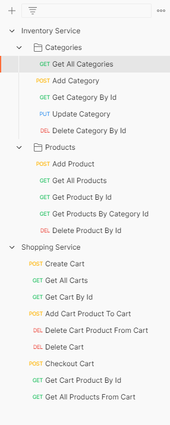

# Final Project

Please checkout subdirectories readme for more details.

- Inventory Service Postman Requests

https://www.postman.com/collections/5875f28d344b8b68f06e




# Inventory Service

## Categories

- GET [GET ALL CATEGORIES]

Response Body

````json
[
  {
    "categoryId": 1,
    "categoryName": "Test Category"
  },
  {
    "categoryId": 2,
    "categoryName": "Test Category 2"
  }
]

````

--------

- POST [CREATE CATEGORY]

Request Body

````json
{
    "categoryName": "Test Category"
}
````

Response Body

````json
{
    "categoryId": 1,
    "categoryName": "Test Category"
}
````

--------------------

- GET [GET CATEGORY BY ID] @PathVariable id

Response Body

````json
{
    "categoryId": 1,
    "categoryName": "Test Category"
}
````

if not exist

````json
{
    "date": "11-10-2022 15:55:54",
    "message": "CATEGORY_NOT_FOUND",
    "details": "Category not found with given id, check your category id"
}
````
--------------------


- PUT [UPDATE CATEGORY] @PathVariable id

Request Body

````json
{
    "categoryName": "Test Category Updated"
}
````

Response Body

````json
{
    "categoryId": 1,
    "categoryName": "Test Category Updated"
}
````

if not exist

````json
{
    "date": "11-10-2022 15:55:54",
    "message": "CATEGORY_NOT_FOUND",
    "details": "Category not found with given id, check your category id"
}
````

--------------------

- DELETE [DELETE CATEGORY] @PathVariable id

Response Body

Response Status 200

if not exist

````json
{
    "date": "11-10-2022 15:55:54",
    "message": "CATEGORY_NOT_FOUND",
    "details": "Category not found with given id, check your category id"
}
````

--------------------


## Products

--------------------

- GET [GET ALL PRODUCTS]

Response Body

````json
[
  {
    "productId": 1,
    "productName": "Test Product",
    "salesPrice": 100,
    "category": {
      "categoryId": 1,
      "categoryName": "Test Category"
    }
  },
  {
    "productId": 2,
    "productName": "Test Product 2",
    "salesPrice": 200,
    "category": {
      "categoryId": 1,
      "categoryName": "Test Category"
    }
  }
]
````

--------------------

- POST [CREATE PRODUCT]

Request Body

````json
{
  "productName": "Adidas",
  "salesPrice": 300,
  "category": {
    "categoryId": 952,
    "categoryName": "Bot"
  }
}
````

Response Body

````json
{
  "productId": 752,
  "productName": "Adidas",
  "salesPrice": 300,
  "category": {
    "categoryId": 1053,
    "categoryName": "Test Category 2"
  }
}
````

if category not exist

````json
{
    "date": "11-10-2022 15:55:54",
    "message": "CATEGORY_NOT_FOUND",
    "details": "Category not found with given id, check your category id"
}
````

--------------------

- GET [GET PRODUCT BY ID] @PathVariable id

Response Body

````json
{
  "productId": 1,
  "productName": "Test Product",
  "salesPrice": 100,
  "category": {
    "categoryId": 1,
    "categoryName": "Test Category"
  }
}
````

if not exist

````json
{
    "date": "11-10-2022 15:55:54",
    "message": "PRODUCT_NOT_FOUND",
    "details": "Product not found with given id, check your product id"
}
````

--------------------

- GET [GET PRODUCT BY CATEGORY ID] @PathVariable id

Response Body

````json
[
  {
    "productId": 1,
    "productName": "Test Product",
    "salesPrice": 100,
    "category": {
      "categoryId": 1,
      "categoryName": "Test Category"
    }
  },
  {
    "id": 2,
    "productName": "Test Product 2",
    "salesPrice": 200,
    "category": {
      "categoryId": 1,
      "categoryName": "Test Category"
    }
  }
]
````

if not exist

````json
{
    "date": "11-10-2022 15:55:54",
    "message": "CATEGORY_NOT_FOUND",
    "details": "Category not found with given id, check your category id"
}
````

--------------------

# Shopping Service

## Cart

--------------------

- GET [GET ALL CARTS]

Response Body

````json
[
  {
    "cartId": 502,
    "customerName": "Tevfik Kadan",
    "totalAmount": 0.00,
    "paid": false,
    "cartProducts": []
  },
  {
    "cartId": 552,
    "customerName": "Dilek Kadan",
    "totalAmount": 0.00,
    "paid": false,
    "cartProducts": []
  },
  {
    "cartId": 652,
    "customerName": "Kaan Kadan",
    "totalAmount": 0.00,
    "paid": false,
    "cartProducts": []
  },
  {
    "cartId": 452,
    "customerName": "Mustafa Kadan",
    "totalAmount": 0.00,
    "paid": true,
    "cartProducts": []
  },
  {
    "cartId": 602,
    "customerName": "Mehmet Kadan",
    "totalAmount": 2700.00,
    "paid": false,
    "cartProducts": [
      {
        "cartProductId": 702,
        "cartId": 602,
        "productId": 652,
        "salesQuantity": 3,
        "salesPrice": 300.00,
        "lineAmount": 900.00
      },
      {
        "cartProductId": 703,
        "cartId": 602,
        "productId": 652,
        "salesQuantity": 3,
        "salesPrice": 300.00,
        "lineAmount": 900.00
      },
      {
        "cartProductId": 704,
        "cartId": 602,
        "productId": 652,
        "salesQuantity": 3,
        "salesPrice": 300.00,
        "lineAmount": 900.00
      }
    ]
  },
  {
    "cartId": 702,
    "customerName": "string",
    "totalAmount": 0.00,
    "paid": true,
    "cartProducts": []
  }
]
````

--------------------

- POST [CREATE CART]

Request Body

````json
{
  "customerName": "Tevfik Kadan"
}
````

Response Body

````json
{
  "cartId": 752,
  "customerName": "Tevfik Kadan",
  "totalAmount": 0.00,
  "paid": false,
  "cartProducts": []
}
````

if already exist

````json
{
    "date": "11-10-2022 15:55:54",
    "message": "CART_ALREADY_EXIST_WITH_THIS_CUSTOMER_NAME",
    "details": "Customer already exist with this name, check your customer name"
}
````

--------------------

- GET [GET CART BY ID] @PathVariable id

Response Body

````json
{
  "cartId": 752,
  "customerName": "Tevfik Kadan",
  "totalAmount": 0.00,
  "paid": false,
  "cartProducts": []
}
````

if not exist

````json
{
    "date": "11-10-2022 15:55:54",
    "message": "CART_NOT_FOUND",
    "details": "Cart not found with given id, check your cart id"
}
````

--------------------

- POST [ADD PRODUCT TO CART]

Request Body

````json
{
  "cartId": 752,
  "productId": 652,
  "salesQuantity": 3
}
````

Response Body

````json
{
  "cartId": 752,
  "customerName": "T Kadan",
  "totalAmount": 300.00,
  "paid": false,
  "cartProducts": [
    {
      "cartProductId": 702,
      "cartId": 752,
      "productId": 703,
      "salesQuantity": 3,
      "salesPrice": 100.00,
      "lineAmount": 300.00
    }
  ]
}
````

if cart not exist

````json
{
    "date": "11-10-2022 15:55:54",
    "message": "CART_NOT_FOUND",
    "details": "Cart not found with given id, check your cart id"
}
````

if product not exist

````json
{
    "date": "11-10-2022 15:55:54",
    "message": "PRODUCT_NOT_FOUND",
    "details": "Product not found with given id, check your product id"
}
````

--------------------

- DELETE [DELETE PRODUCT FROM CART] @PathVariable cartId, @PathVariable cartProductId

Response Body

````json
{
  "cartId": 752,
  "customerName": "T Kadan",
  "totalAmount": 0.00,
  "paid": false,
  "cartProducts": []
}
````

if cart not exist

````json
{
    "date": "11-10-2022 15:55:54",
    "message": "CART_NOT_FOUND",
    "details": "Cart not found with given id, check your cart id"
}
````

if cart product not exist

````json
{
    "date": "11-10-2022 15:55:54",
    "message": "CART_PRODUCT_NOT_FOUND",
    "details": "Cart product not found with given id, check your cart product id"
}
````

--------------------

- DELETE [DELETE CART] @PathVariable cartId

Response Status OK

if cart not exist

````json
{
    "date": "11-10-2022 15:55:54",
    "message": "CART_NOT_FOUND",
    "details": "Cart not found with given id, check your cart id"
}
````

--------------------

- POST [CHECKOUT CART] @PathVariable cartId

if cart products exist in cart, cart products will be deleted and cart will be set true also total amount will be set 0.

Response Body

````json
{
  "cartId": 752,
  "customerName": "T Kadan",
  "totalAmount": 0.00,
  "paid": true,
  "cartProducts": []
}
````

if cart not exist

````json
{
    "date": "11-10-2022 15:55:54",
    "message": "CART_NOT_FOUND",
    "details": "Cart not found with given id, check your cart id"
}
````

--------------------

- GET [GET CART PRODUCTS BY CART ID] @PathVariable cartId

Response Body

````json
[
  {
    "cartProductId": 702,
    "cartId": 752,
    "productId": 703,
    "salesQuantity": 3,
    "salesPrice": 100.00,
    "lineAmount": 300.00
  }
]
````

if cart not exist

````json
{
    "date": "11-10-2022 15:55:54",
    "message": "CART_NOT_FOUND",
    "details": "Cart not found with given id, check your cart id"
}
````

--------------------

- GET [GET CART PRODUCT BY CART PRODUCT ID] @PathVariable cartProductId

Response Body

````json
{
  "cartProductId": 702,
  "cartId": 752,
  "productId": 703,
  "salesQuantity": 3,
  "salesPrice": 100.00,
  "lineAmount": 300.00
}
````

if cart product not exist

````json
{
    "date": "11-10-2022 15:55:54",
    "message": "CART_PRODUCT_NOT_FOUND",
    "details": "Cart product not found with given id, check your cart product id"
}
````