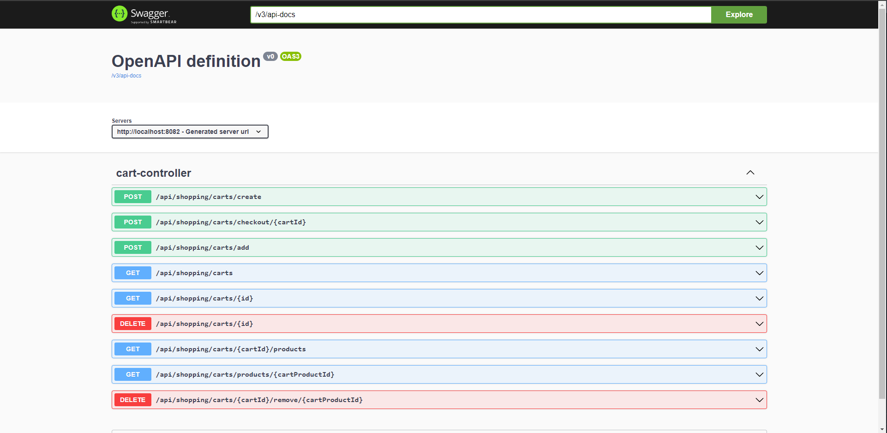

# Shopping Service

If you open application. You can test endpoints via Swagger UI. Also don't forget to look test folder.

- http://localhost:8082/v3/swagger-ui/index.html?configUrl=/v3/api-docs/swagger-config#/

Create Cart Entity with following fields:

- Long cartId
- String customerName
- List (CartProduct) cartProducts
- BigDecimal totalAmount
- Boolean isPaid

Create 8 endpoint for Cart Rest controller:

- POST /api/shopping/carts/create. Create a new cart.
- GET /api/shopping/carts. Get all carts.
- GET /api/shopping/carts/{cartId}. Get a cart by id
- POST /api/shopping/carts/add. Add a product to cart.
- DELETE /api/shopping/carts/{cartId}/remove/{cartProductId}. Remove a product from cart.
- DELETE /api/shopping/carts/{cartId}. Delete a cart by id.
- POST /api/shopping/carts/checkout/{cartId}. Pay a cart.
- GET /api/shopping/carts/products/{cartProduct}. Get a product from cart.
- GET /api/shopping/carts/{cartId}/products. Get all products from cart.

Create CartProduct Entity with following fields:
- Cart cart
- Long productId
- Integer quantity
- BigDecimal salesPrice
- BigDecimal lineAmount