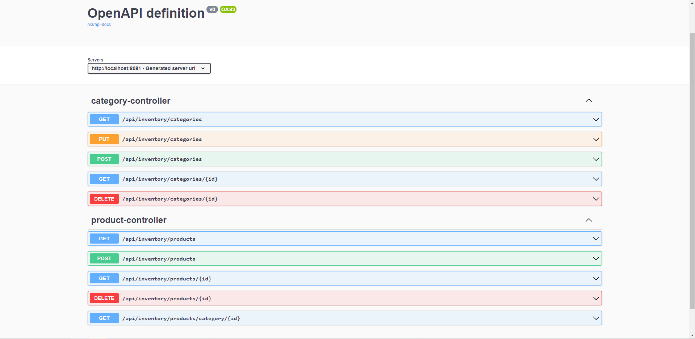

# Inventory Service

If you open application. You can test endpoints via Swagger UI. Also don't forget to look test folder.

- http://localhost:8081/v3/swagger-ui/index.html?configUrl=/v3/api-docs/swagger-config#/

Create Category Entity with following fields:
- Long categoryId
- String categoryName
- List (Product) products

Create 5 endpoint for Category Rest controller:
- POST /api/inventory/categories. Create a new category
- GET /api/inventory/categories. Get all categories
- GET /api/inventory/categories/{categoryId}. Get a category by id
- PUT /api/inventory/categories. Update a category
- DELETE /api/inventory/categories/{categoryId}. Delete a category by id.

Create Product Entity with following fields:
- Long productId
- String productName
- BigDecimal salesPrice
- Category category

Create 5 endpoint for Product Rest controller:
- POST /api/inventory/products. Create a new product.
- GET /api/inventory/products. Get all products.
- GET /api/inventory/products/{productId}. Get a product by id
- DELETE /api/inventory/products/{productId}. Delete a product by id.
- GET /api/inventory/products/category/{categoryId}. Get all products by category id.